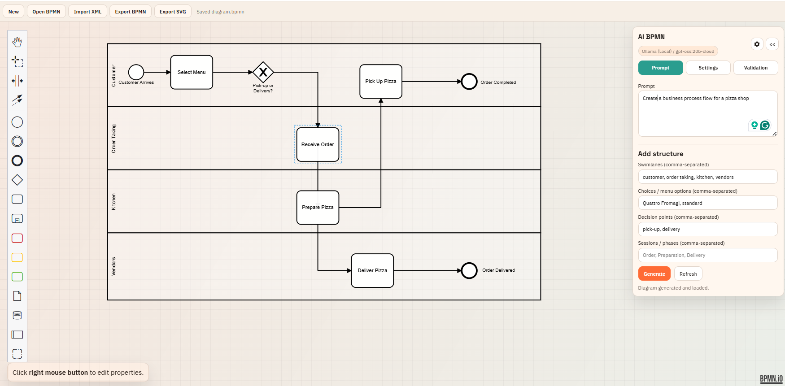

# AI BPMN Panel (bpmn-js example)

[](https://bacon-ai.cloud)

Demo: https://bacon-ai.cloud/demo

This example adds an AI-assisted panel to a bpmn-js modeler. It generates BPMN 2.0 XML from natural-language prompts and loads the result directly into the canvas. The UI includes prompt helpers, validation rules, and a local AI API server to avoid CORS and keep credentials on your machine.



## Features

- Prompt to BPMN 2.0 XML generation
- Validation for missing swimlanes, BPMN DI, and dangling flows
- Auto-fix loop for common issues
- Local AI server with OpenAI, Claude, Gemini, or Ollama support
- Custom palette + context pad from the custom elements demo

## Quick Start

This example depends on the local bpmn-js sources in this repo. Build the distro once so the assets are available.

```sh
# from the repo root
npm install
npm run distro

# run the example
cd examples/ai-bpmn-panel
npm install
npm start
```

The modeler runs at `http://localhost:5000` and the AI server runs at `http://localhost:5174`.

## How It Works

1. The UI collects your prompt, model, and AI settings.
2. A local Node server (`server.js`) calls the selected AI provider.
3. The server returns BPMN 2.0 XML only.
4. The app validates the XML and optionally auto-fixes common issues.
5. The diagram is imported into the canvas automatically.

## Sample Prompts

- "Model a pizza delivery process with Customer, Kitchen, Driver swimlanes and decisions for pickup vs delivery."
- "Create an order fulfillment flow with payment verification and a retry loop on payment failure."
- "Design a support ticket triage process with L1, L2, and L3 handoffs and an SLA breach escalation."
- "Generate a purchase approval process with manager approval required above $5,000."
- "Model a hiring pipeline with screenings, interviews, and offer acceptance."

## Credentials

Set one of the following environment variables (or paste a credential in the UI):

- `OPENAI_API_KEY`
- `ANTHROPIC_API_KEY` or `ANTHROPIC_AUTH_TOKEN`
- `GEMINI_API_KEY`
- `OLLAMA_URL` (optional, defaults to `http://localhost:11434`)
- `AI_PORT` (optional, defaults to `5174`)

For Ollama, ensure you have local models installed (for example: `ollama pull llama3.1`).

## API Endpoints

- `GET /api/providers` returns the provider and model catalog.
- `POST /api/generate` generates BPMN XML from a prompt.

Example payload:

```json
{
  "provider": "openai",
  "model": "gpt-4o-mini",
  "prompt": "Order-to-cash flow with swimlanes",
  "credential": "optional api key",
  "systemPrompt": "optional system prompt",
  "temperature": 0.2,
  "maxTokens": 1400
}
```

## Troubleshooting

- "No local Ollama models found": run `ollama pull llama3.1` or choose another provider.
- "AI server not reachable": confirm `npm start` is running and `AI_PORT` matches the UI.
- "Select a model in settings": open Settings and pick a model from the dropdown.
- "Missing BPMN DI": keep validation enabled or enable auto-fix to regenerate.

## Security Note

Credentials entered in the UI are stored in browser `localStorage` on your machine. The local AI server only runs on your machine and is not exposed unless you explicitly bind it to a public interface.

## License

See `LICENSE` in the repo root.
